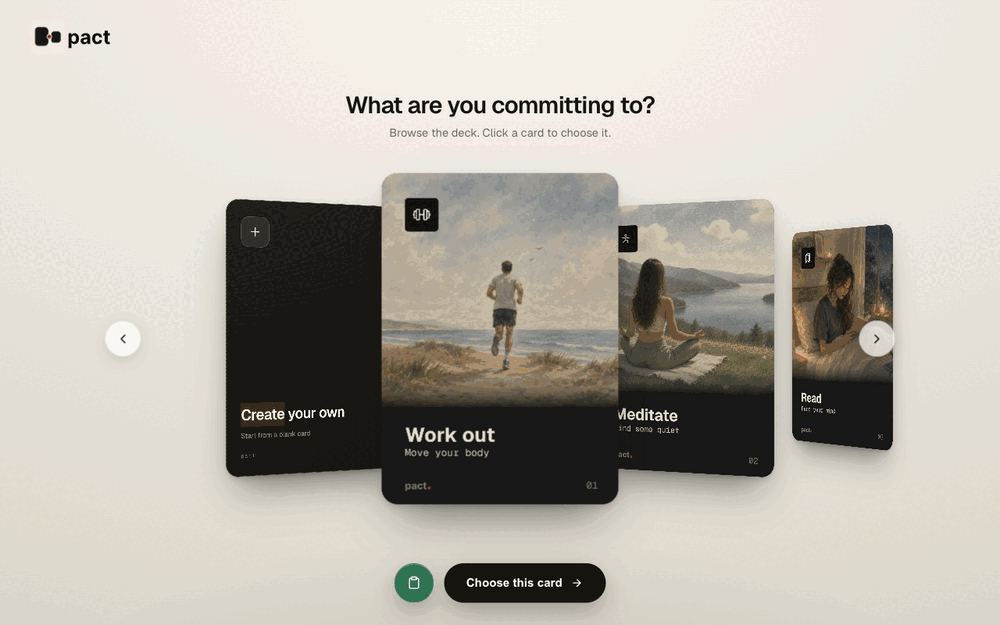
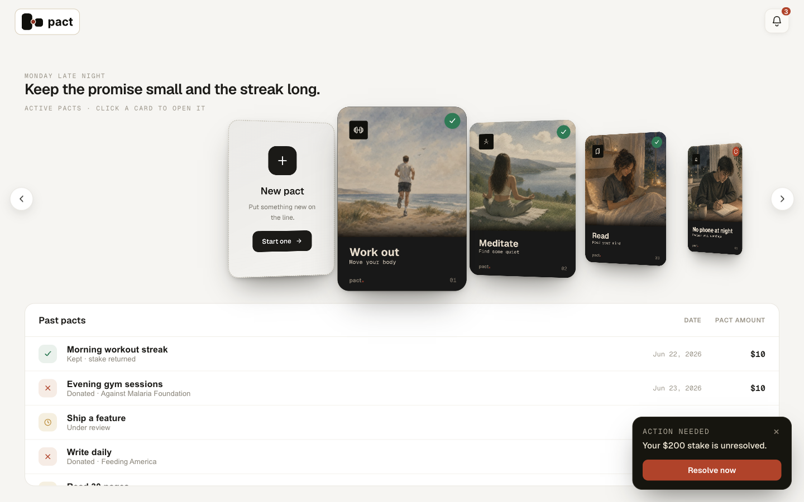
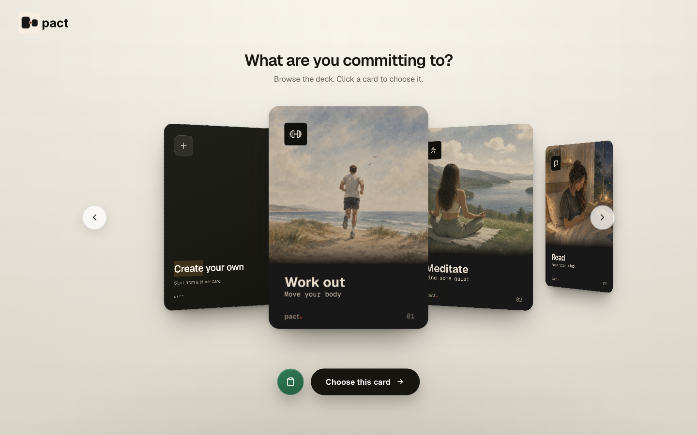

# Pact

**A binding agreement with yourself.** Stake money on a goal. Prove you did it by the deadline. If you miss, the stake goes to a charity you chose, paid by your own AI agent.

Pact turns a promise into something with teeth. You set the terms, an agent coaches you toward the finish, and the money only moves on a verified miss. It runs as a local service that your **Hermes agent drives as a skill** (`/pact`), so the same agent you already talk to becomes your coach, your referee, and the one who settles up.

Live landing + create flow: **https://chadd40.github.io/pact/**

> Built for the **Hermes + NVIDIA** hackathon. Stack: a Hermes agent skill (`/pact`), Link for the stake approval and single-use virtual card, NVIDIA Nemotron via NIM for the fallback brain, and safety rails modeled on NVIDIA NeMo Guardrails.



---

## How it works

1. **Make a pact.** Describe a goal in plain language ("work out 4x a week for two weeks"). Your agent runs a short interview, recommends fair terms, and you pick the stake and the charity.
2. **Approve the stake once, in Link.** At creation, Pact opens a Link spend request and provisions a single-use, merchant-locked virtual card. You approve the hold on your phone. No money moves yet.
3. **Do the work and prove it.** Submit a photo, a screenshot, or a log. The backend runs anti-cheat (single-use token, dedup, server time is truth) and your agent judges each proof against a rubric frozen at creation.
4. **Settle on the deadline.** Kept it? The hold is released, nothing is charged. Missed it? You get a 24 hour window to dispute with extra proof.
5. **The agent pays the charity.** After a verified miss and the dispute window, the pact sits as `donation_pending`. Your agent fetches the single-use card, opens the charity's donate page, pays the stake, and Pact confirms the charge through Link before marking it `donation_complete`.



The split is deliberate: **the agent is the brain** (drafting, judging proofs, coaching, writing the verdict) and **the backend is deterministic** (anti-cheat, the state machine, money, scheduling). Correctness of the money path never depends on an LLM round trip.

---

## Works with your agent, as a skill

Pact is not a separate chatbot. It installs into your Hermes agent as the **`/pact` skill**, so your agent gains a full commitment workflow it can run inline while you talk to it normally.



### What `/pact` can do

| Command | What it does |
| --- | --- |
| `/pact create <goal>` | Run the drafting interview: recommend fair terms, let you tweak the dials (frequency, duration, stake, charity), then create and pre-authorize the stake. |
| `/pact status [id]` | Show the countdown, your pace, and the next action. |
| `/pact submit <id>` | Issue a proof token, accept your proof, run anti-cheat, and judge it against the frozen rubric. |
| `/pact coach <id> <message>` | Talk to your coach in the pact thread. It reads the history first so its advice stays consistent. |
| `/pact check <id>` | Settle early: judge any pending proofs now. |
| `/pact verdict <id>` | Settle and return the evidence and verdict packet. |
| `/pact freeze <id>` | Spend a freeze to extend the deadline by one period (pre-deadline only). |
| `/pact dispute <id>` | Submit extra proof into the single dispute window. |
| `/pact pay <id>` | The last mile: pay a failed pact's charity with the pre-approved card. |
| `/pact renew <id>` | Clone a finished pact's terms into a fresh one. |
| `/pact me` | Your streak and history ("kept N of last M"). |
| `/pact serve` | Worker mode: author coach, judge, and draft results for the website, and pay any owed pacts. |
| `/pact outbox` | Relay queued coaching nudges to you through the agent's own channel. |

### Two ways an agent drives it

- **As a skill (the primary path).** Inside a Hermes agent, `/pact` reasons inline with the agent's own model and POSTs the structured result to the backend. The agent is the coach and referee.
- **As MCP tools.** Any MCP-compatible agent can drive Pact through the bundled server (`pact mcp`), which exposes 27 thin pass-through tools over the same API (draft, create, submit proof, coach, settle, resolve donation, and so on). Same shapes, same results.

Deterministic work stays server-side either way. A tool cannot use your model, so no tool reasons for you: it just persists what the agent reasoned.

---

## Prerequisites

- **Link CLI**, authenticated with a funding method. Pact's backend shells `link-cli` directly to open the spend request and provision the single-use virtual card. Verify with `link-cli auth status` and `link-cli payment-methods list`.
- **A Hermes agent** with the `/pact` skill installed. Hermes loads skills from `~/.hermes/skills/`, so copy the skill there and restart Hermes. The agent reaches the backend at `http://127.0.0.1:8000` (override with `PACT_BASE_URL`).
- **Python 3.11+ and [uv](https://github.com/astral-sh/uv)** for the backend and sidecar.
- **Node 18+** to build the web SPA.

---

## Run it locally

```bash
# 1. Backend deps (gives .venv/bin/pact-sidecar)
uv sync

# 2. Build the web SPA (serves from the sidecar)
cd web && npm install && npm run build && cd ..

# 3. Launch the sidecar (API + built SPA on :8000)
PACT_SPA_DESKTOP=1 .venv/bin/pact-sidecar
# open http://127.0.0.1:8000
```

Or use the scripted demo profile (time-compressed clock, simulated money, on-screen controls):

```bash
./scripts/demo/reset.sh demo     # clean slate
./scripts/demo/launch.sh demo    # wait for PACT_SIDECAR_READY, then open :8000
```

**Connect your agent as the live coach.** In your Hermes agent, run `/pact serve`. That polls the backend, authors coach/judge/draft results with your model, and pays any owed pacts. Without a serving agent, the website falls back to a deterministic stub so it still works standalone.

**Or point any MCP client at it:**

```bash
pact mcp --base-url http://127.0.0.1:8000 --agent-token <token>
```

See [`docs/DEMO-RUNBOOK.md`](docs/DEMO-RUNBOOK.md) for the full end-to-end walkthrough (create, coach, miss, dispute, donate).

---

## Optional: NVIDIA Nemotron

On the website path with no agent serving, the backend needs a fallback brain. By default that is a deterministic stub. Set an NVIDIA key and the fallback reasons on **Nemotron via NIM** (OpenAI-compatible) instead.

```bash
uv pip install -e '.[nemotron]'

export PACT_NEMOTRON_API_KEY=nvapi-...   # or NVIDIA_API_KEY
# optional overrides:
export PACT_NEMOTRON_MODEL=nvidia/llama-3.1-nemotron-70b-instruct
export PACT_NEMOTRON_BASE_URL=https://integrate.api.nvidia.com/v1
```

With no key set, the stub is used, no network is touched, and tests stay green.

Pact also models its safety rails on **NVIDIA NeMo Guardrails**. The spend gate (verified miss + approved-charity allowlist + amount ceiling) is a deterministic execution rail today; `PACT_GUARDRAILS=nemo` is the reserved seam to enforce with the real `nemoguardrails` runtime.

---

## Safety

- Real money moves **only after explicit human Link approval**, and only behind `PACT_PAYMENT_MODE=link_cli` with `PACT_LINK_MODE=live`. Defaults are safe (`test_link` / `dry_run`).
- The virtual card is **single-use and merchant-locked** to the one charity. Pact stores only card metadata (last4, brand, expiry), never the card number.
- **Link approval is not the same as a charity receipt.** The evidence packet stays honest until a real, provider-confirmed receipt exists.
- The agent **refuses unsafe goals** (self-harm, restrictive eating, coercive or third-party stakes) at draft time, with a supportive message and a crisis-resource line.

---

## Optional: real charity checkout

Tier 2 drives a charity's real donate page with Playwright to complete the donation autonomously:

```bash
uv pip install -e '.[checkout]'
playwright install chromium
```

Lazy-imported, so the core app and packaged build stay lean.

---

## Desktop app

Pact also ships as a Tauri desktop app (Apple Silicon) that bundles the sidecar. Build it with `npm run tauri build` in `web/`, then re-sign for local use with `scripts/package-macos-adhoc.sh`. A signed, notarized download is pending Apple Developer setup (see [`docs/GO-LIVE.md`](docs/GO-LIVE.md)).

---

## Repo layout

| Path | What lives there |
| --- | --- |
| `src/pact/` | Backend: FastAPI API, state machine, anti-cheat, reasoning, payment, scheduler, MCP server |
| `web/` | React SPA (landing, create flow, dashboard) and the Tauri desktop shell |
| `.claude/skills/pact/`, `.agents/skills/pact/` | The `/pact` skill (`SKILL.md`) |
| `scripts/demo/` | Reset, launch, and drive scripts for the two-phase demo |
| `docs/` | Demo runbook, go-live and money runbooks, readiness review |
| `tests/` | Backend and web test suites |

---

## Docs

- [`docs/DEMO-RUNBOOK.md`](docs/DEMO-RUNBOOK.md) — record the whole app end to end
- [`docs/END-TO-END-READINESS.md`](docs/END-TO-END-READINESS.md) — what is verified and what remains
- [`docs/live-money-runbook.md`](docs/live-money-runbook.md) — the real link-cli money path
- [`docs/GO-LIVE.md`](docs/GO-LIVE.md) — distribution and notarization
- `.claude/skills/pact/SKILL.md` — the full skill contract (endpoints, MCP tools, reasoning split)
</content>
</invoke>
